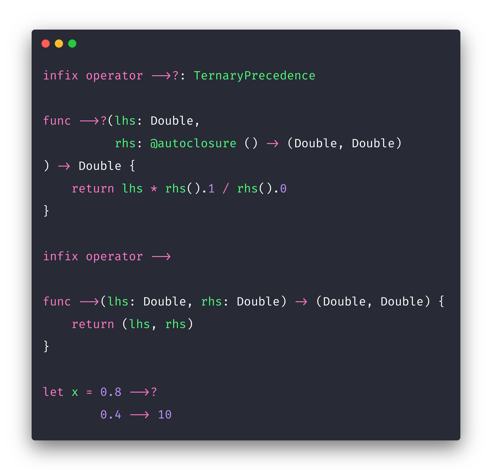

# Swift Custom Operator - Rule of 3

This a playground to showcase a Swift Custom Operator that implements the Rule of Three from Elementary Math. 

**Blog Post:** https://medium.com/@nuno.vieira/swift-custom-operator-the-rule-of-3-math-operation-e8ecb47f5f52
